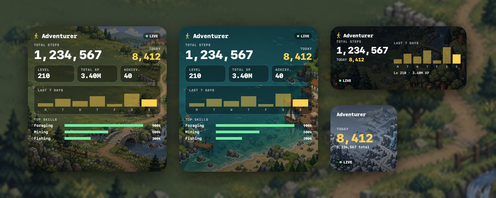
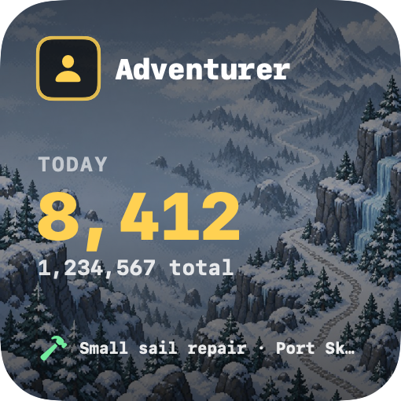
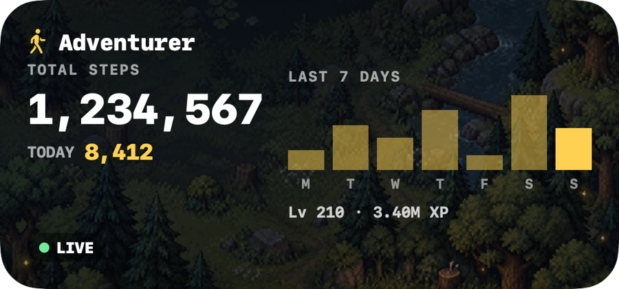
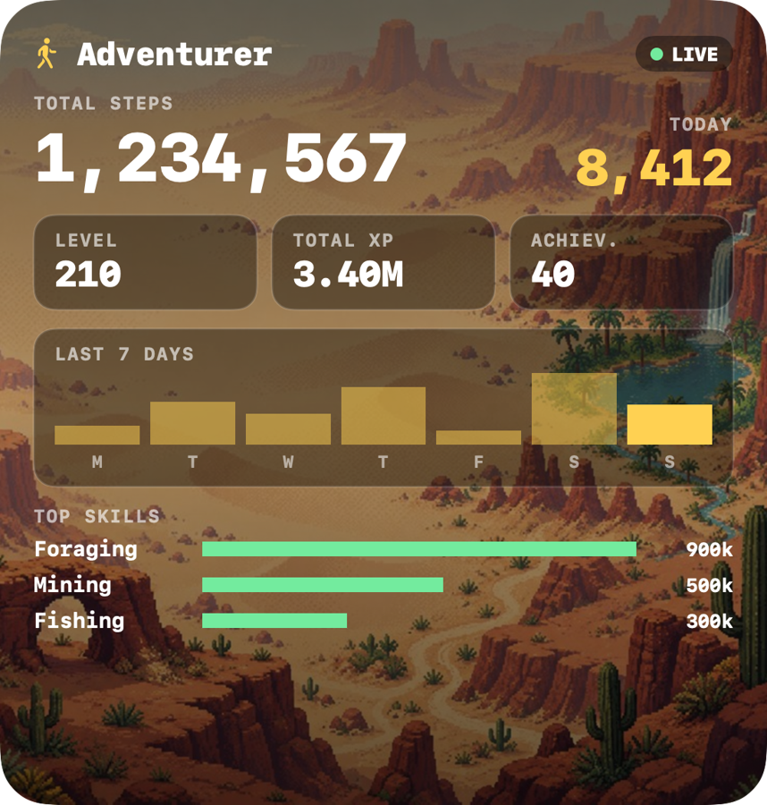

<div align="center">



# Widget for WalkScape

**Your WalkScape steps and stats, right on your Mac desktop.**

[](#install-in-a-minute)
[](LICENSE)
[](NOTICE.md)

[**Website**](https://jaydenbarnescs-tech.github.io/walkscape-desktop-widget/) ·
[**Install**](#install-in-a-minute) ·
[**FAQ**](#faq) ·
[**Credits**](#credits)

</div>

---

## What you get

| | |
|---|---|
| 🧑 | Your **character portrait** and name |
| 👣 | Total steps, **today's steps** and a 7-day chart with a number for every day |
| ⭐ | **Character level** (from your steps, with steps to the next level) and total skill level |
| 🛠️ | **Skill levels with XP to the next level** |
| 📍 | Where you are and what you're doing (from the same data the official map uses) |
| 🖼️ | Pixel-art scenery that matches where your character is (meadow, forest, coast, mountain, desert), or pick one |
| 🟢 | A **LIVE** badge when the game synced in the last 3 minutes, otherwise how long ago it did |
| 🔒 | No password, no account linking, no tracking, no ads |

Three sizes, so it fits wherever you want it:

<p align="center">
  
  &nbsp;
  
  &nbsp;
  
</p>

## Install in a minute

You need a Mac running **macOS 14 (Sonoma) or newer**. No coding, no developer tools. Pick one way:

### Option A: Download (no Terminal)

1. **[⬇ Download for Mac](https://github.com/jaydenbarnescs-tech/walkscape-desktop-widget/releases/latest/download/WalkScape-Widget.zip)**, open the zip (double-click), then double-click **WalkScape Widget**.
2. **Approve it once.** macOS says it can't verify the app because this free fan project isn't signed with a paid Apple developer account. Click **Done**, open **System Settings → Privacy & Security**, scroll down, click **Open Anyway** and enter your Mac password. You only do this once.
3. The app moves itself into place and opens. **Type your character name and click it** (or paste your [walkstats.app](https://walkstats.app) link).
4. Right-click an empty spot on the desktop → **Edit Widgets** → search **WalkScape** → drag a size onto the desktop → **Done**.

### Option B: One line in Terminal (skips the approval step)

**1. Open Terminal.** Press <kbd>⌘</kbd> + <kbd>Space</kbd>, type `Terminal`, press <kbd>Return</kbd>. (It is a built-in Mac app.)

**2. Paste this line and press <kbd>Return</kbd>:**

```bash
curl -fsSL https://raw.githubusercontent.com/jaydenbarnescs-tech/walkscape-desktop-widget/main/get.sh | bash
```

> It downloads the latest release from this page and installs it. It is a short script, [read it here](get.sh) if you like.

**3. Choose your character.** A small window opens. Type your character name and click it.
Can't find your name? Paste your [walkstats.app](https://walkstats.app) profile link instead.

**4. Put it on your desktop.** Right-click an empty spot on the desktop → **Edit Widgets** → search **WalkScape** → drag a size onto the desktop → **Done**.

That's it. 🎉

<details>
<summary><b>Prefer to build it yourself?</b></summary>

Needs the Xcode Command Line Tools (`xcode-select --install`). Full Xcode is not required.

```bash
git clone https://github.com/jaydenbarnescs-tech/walkscape-desktop-widget.git
cd walkscape-desktop-widget
./install.sh
```

Remove it with `./uninstall.sh`.
</details>

## FAQ

<details>
<summary><b>My steps are not updating. Why?</b></summary>

The widget shows what WalkScape's servers know, and the game only uploads your progress **while the WalkScape app is open on your phone** (about once a minute). Open the game and the badge turns green and says LIVE within a minute or two. If the badge shows a time like "7 min", that is how long ago the game last synced. macOS also refreshes widgets only about every 5 minutes.
</details>

<details>
<summary><b>The daily steps don't match the game's Daily steps chart. Why?</b></summary>

The game's chart comes straight from your phone. The widget can only see the lifetime total that WalkScape publishes, and that total only changes **when the app syncs**. Steps walked while the app is closed show up later in one lump, on the day of the sync, so a day can look too low and the next one too high. Over time the totals always agree; individual days may not. If today looks wrong, open the setup app and use **Today's steps look off?** to type the number from the game's Stats page.
</details>

<details>
<summary><b>Why does "Today" start at zero?</b></summary>

WalkScape only reports lifetime steps. The widget keeps its own small daily log, so today's count and the 7-day chart begin when you install it and fill in as you walk. Days from before you installed show a dash.
</details>

<details>
<summary><b>Is it safe? Does it need my password?</b></summary>

No password and no token, ever. "Signing in" only means choosing which character to show, because WalkScape character stats are public. The widget is sandboxed by macOS: it can reach the internet and read its own settings folder, nothing else.
</details>

<details>
<summary><b>The widget isn't listed in Edit Widgets.</b></summary>

Open **WalkScape Widget** from the *Applications* folder inside your user folder once, then try again. If it is still missing, run the install line again, then log out and back in.
</details>

<details>
<summary><b>How do I remove it?</b></summary>

Right-click the widget → **Remove Widget**. Then drag **WalkScape Widget** from your user folder's *Applications* folder to the Trash. To also delete saved settings, remove the hidden folder `~/.config/walkscape-widget`.
</details>

<details>
<summary><b>How does it work?</b></summary>

- Every ~5 minutes the widget reads `api.web.walkscape.app/portal/shared/characters/<id>`, WalkScape's public, unauthenticated character endpoint.
- Name search builds a local player list from the public leaderboard pages once a day (cached in `~/.config/walkscape-widget/`).
- Your character choice is stored in `~/.config/walkscape-widget/config.json`.
- These endpoints are unofficial and may change.

| Folder | What |
|---|---|
| `Shared/` | API client, settings, formatting |
| `Widget/` | The WidgetKit widget |
| `App/` | The character picker app |
| `Resources/` | Backgrounds and icon |
| `art/` | Prompts used to generate the backgrounds |
</details>

## Credits

**[WalkScape](https://walkscape.app) is created by Not a Cult Oy.** WalkScape, its name, logo, characters, world and all game content are © Not a Cult Oy, all rights reserved. This project only exists because of their game, and every number it shows comes from their service. Please go and support them: **<https://walkscape.app>**

Thanks also to the community tools that came first, especially [WalkStats](https://walkstats.app) and everything in the [Walkscape-Index](https://walkscape-index.github.io/), and to the [official wiki](https://wiki.walkscape.app).

The pixel-art landscapes and the app icon are original artwork generated with OpenAI's image generation from the prompts in [`art/gen.sh`](art/gen.sh). No WalkScape artwork, logos or map tiles are included.

## Unofficial fan project

This is a free, non-commercial fan project. It is **not** affiliated with, endorsed by, or sponsored by Not a Cult Oy. If the owners of WalkScape would like anything changed or removed, it will be done promptly: please [open an issue](../../issues) or contact the repository owner. Full details in [NOTICE.md](NOTICE.md).

## License

Code and original background art: [MIT](LICENSE). The MIT license does **not** cover the WalkScape name, logo or game content, which belong to Not a Cult Oy.
